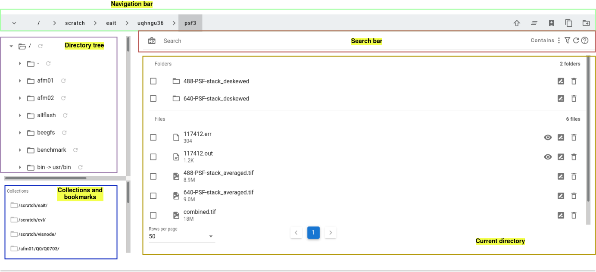

# User Guide

## Files Manager

Files Manager consists of 5 sub components:
<ul>
    <li><b>Navigation bar</b> for navigating up and down in the directory tree</li>
    <li><b>Directory tree</b> for showing where you are in the directory tree</li>
    <li><b>Collections and bookmarks</b> for quick access to your collections and bookmarks</li>
    <li><b>Search bar</b> for filtering files/folders in the current path</li>
    <li><b>Current directory</b> for showing files/folders in the current path</li>
</ul>

### Search bar

IPP supports 4 types of filter
<ul>
    <li><b>Contains</b> Files Manager displays any folder/file that contains the given search text</li>
    <li><b>StartsWith</b> Files Manager displays any folder/file that starts with the given search text</li>
    <li><b>EndsWith</b> Files Manager displays any folder/file that ends with the given search text</li>
    <li><b>Custom</b> Files Manager displays any folder/file that matches the [glob filter](https://facelessuser.github.io/wcmatch/glob/) specified in the given search text</li>
</ul>

### Visualising your image files on CVL
The Characterisation Virtual Laboratory (CVL) platform is an Linux based virtual dekstop that can be run within your browser, populated with open-source software tools such as Fiji and Napari. For more information on how to access CVL please see the following [Guide](https://characterisation-virtual-laboratory.github.io/CVL_Community/CVLWiener/)

Selecting the file from within the Files Manger page will allow you to then click the Launch Virtual Desktop button in the top right toolbar. Here you can spin up a CVL instance and launch the selected image file into either Napari or Fiji. Note you can edit the resources allocated to your CVL session upto a limit of (1xNode, 4xProcessors(cores), 32GB Memory (per processor)).

## Converter

The file converter currently only supports the conversion of .ims files into .tif files. With plans to increase this to other input file types in the future.

### .ims to .tif
The .ims to .tif file converter expects large multi-dimensional (3D time-series) .ims files (either from an Andor Dragonfly Spinning Disc Confocal or from the Imaris Visualisation program) and will output individual timepoints as a .tif file.

## Preprocessing

## Deconvolution

## Jobs Management
