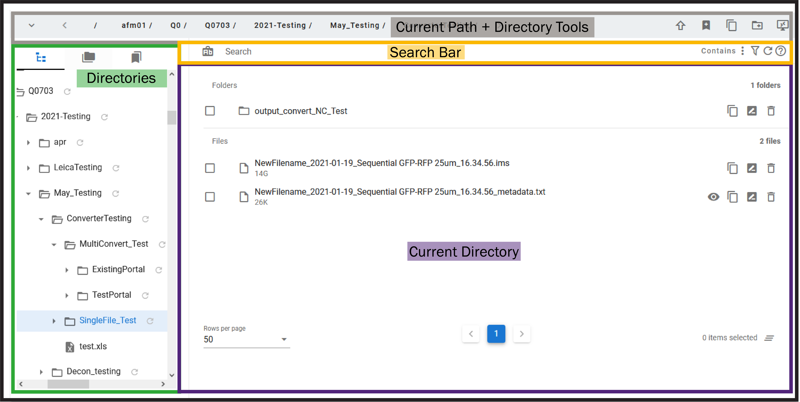
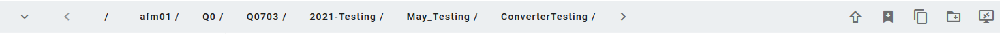
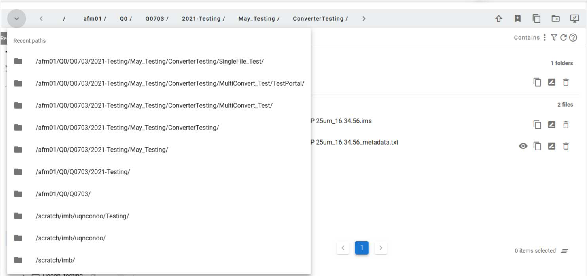
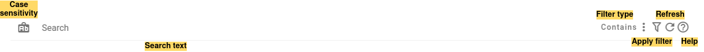
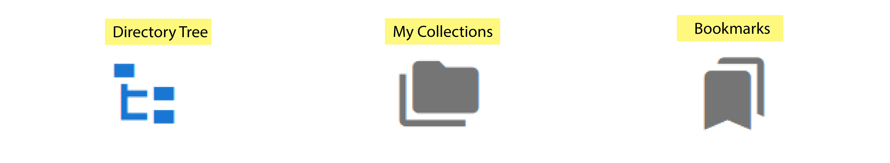
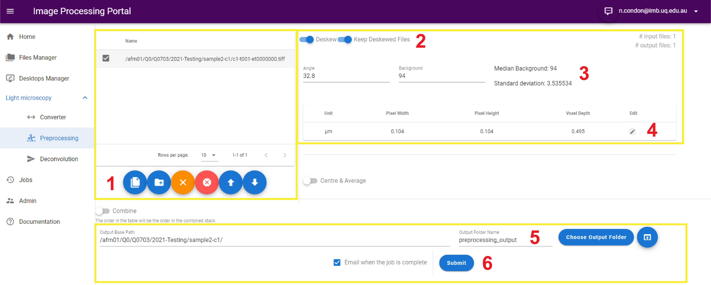
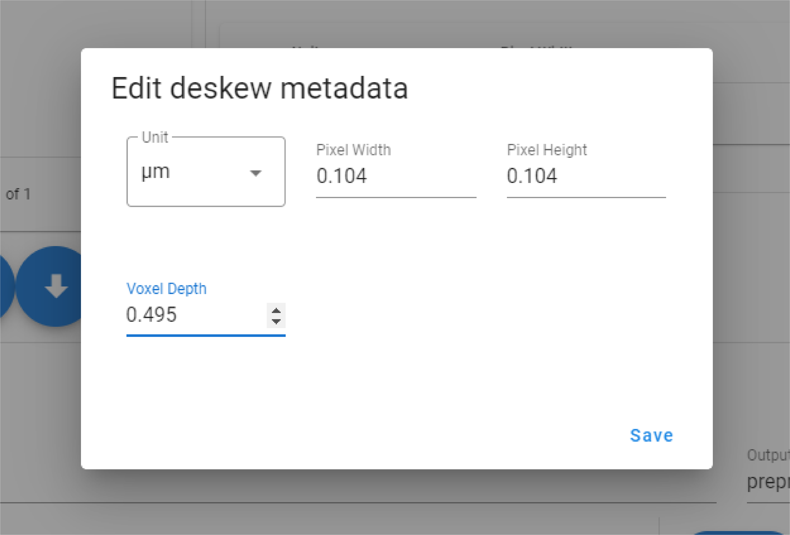
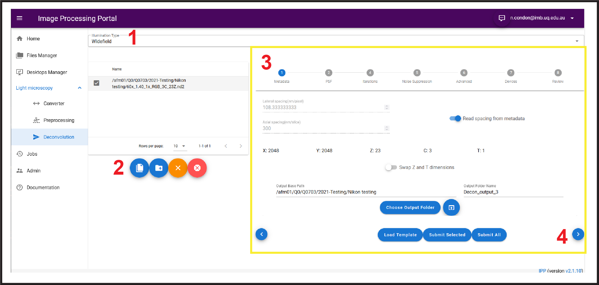
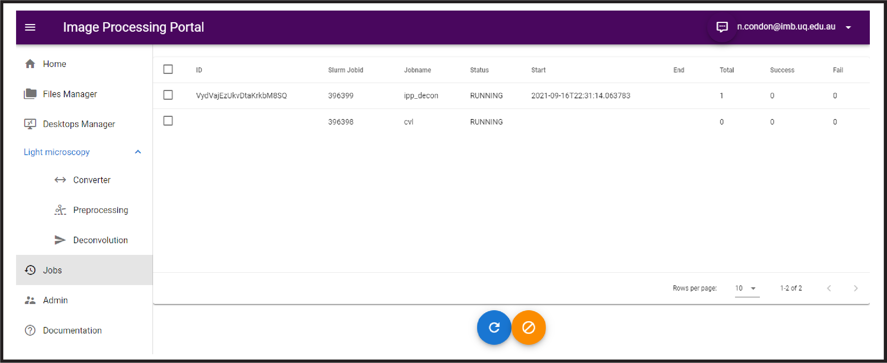

# User Guide

The Image Processing Portal (IPP) is a tool for researchers to easily navigate, process, deconvolve and visualise their data-set via a website GUI. The goal of the IPP is to make High Performance Computing (HPC) more accessible to researchers from a non-computer science background.

This user guide has been prepared to help submit jobs via the Image Processing Portal. Please note that the IPP is still udnergoing development with the goal of quarterly releases. 

The IPP is accessible to UQ staff account holders with access to Weiner HPC following a request to [IMB Microscopy Staff](mailto:microscopes@imb.uq.edu.au)

The IPP works best in Mozilla FireFox browser with known issues in Google Chrome and Apple's Safari Browser.

If at anytime during your usage of the IPP you encounter a bug, or wish to submit a feature request or provide feedback you can click the Feedback Icon () in the top right of the title bar, which will automatically be sent through to the development team. You will also have the option to attach a screenshot to the report.

Tools are currently divided into the following categories:

## Files Manager

Files Manager consists of 4 sub components:
<ul>
    <li><b>Current Path + Directory Tools</b> for navigating up and down in the directory tree and relevant associated tools</li>
    <li><b>Directories </b> for showing where you are in the directory tree, quick access to your data.QBI mounted RDM collections and your bookmarks</li>
    <li><b>Search bar</b> for filtering files/folders in the current path</li>
    <li><b>Current directory</b> for showing files/folders in the current path</li>
</ul>

### Current Path and Directory Tools

The path to the current working location is shown along the top of the Files Manager page. Clicking on individual directory names will cause the current working directory to change to the chosen directory. 

Recent paths used in the portal are displayed when clicking the down arrow in the left of the Current Path bar.
   

<b>Directory Tools available include </b> 
<ul>
    <li>  <em> Allows you to move up one directory level</em> </li>
    <li>  <em> Allows you to save the current directory to your bookmarks list       </em> </li>
    <li>  <em> Allows you to copy the current directory file path to the system      clipboard </em> </li>
    <li>  <em> Allows you to create a new directory at this location </em> </li>
<li>  <em> Allows you open the file within a Virtual Desktop (see below) </em> </li>
</ul>

 

### Search bar

IPP supports 4 types of filter
<ul>
    <li><b>Contains</b> Files Manager displays any folder/file that contains the given search text</li>
    <li><b>StartsWith</b> Files Manager displays any folder/file that starts with the given search text</li>
    <li><b>EndsWith</b> Files Manager displays any folder/file that ends with the given search text</li>
    <li><b>Custom</b> Files Manager displays any folder/file that matches the glob filter specified in the given search text. See [here](https://facelessuser.github.io/wcmatch/glob/) for more information. </li>
</ul>

 

### Directory Groups
Navigating the file system under the IPP is managed by the Directories Groups on the left hand side of the Files Manager Page. 

 

There are 3 Directory Groups:
<ul>
    <li><b>Navigator</b> Displays the full directory tree structure for the complete filesystem</li>
    <li><b>Collections</b> Displays all RDM collections mounted at QBI that the current user has Read/Write permissions for</li>
    <li><b>Bookmarks</b> Displays any directory the current user has bookmarked</li>
 </ul>
 

### Visualising your image files on CVL
The Characterisation Virtual Laboratory (CVL) platform is an Linux based virtual dekstop that can be run within your browser, populated with open-source software tools such as Fiji and Napari. For more information on how to access CVL please see the following [Guide](https://characterisation-virtual-laboratory.github.io/CVL_Community/CVLWiener/)

Selecting the file from within the Files Manger page will allow you to then click the Launch Virtual Desktop button in the top right toolbar. Here you can spin up a CVL instance and launch the selected image file into either Napari or Fiji. Note you can edit the resources allocated to your CVL session upto a limit of (1xNode, 4xProcessors(cores), 32GB Memory (per processor)).

## Desktops Manager
The desktops manager page lets you create a CVL desktop environment, or if you already have one available you can click Show Desktop to create a new tab with the CVL session running. You can also kill a desktop session by clicking the trash can icon. 
  
  

## Converter

The file converter currently only supports the conversion of .ims files into .tif files. With plans to increase this to other input file types in the future.

### .ims to .tif
The .ims to .tif file converter expects large multi-dimensional (3D time-series) .ims files (either from an Andor Dragonfly Spinning Disc Confocal or from the Imaris Visualisation program) and will output individual timepoints as a .tif file.

## Preprocessing
Currently in beta this page can be used to distil PSFs or perform Lattice Light-sheet specific deskewing (without deconvolution).
 

### Deskewing (For LLS)
Images generated on a Lattice Light-sheet microscope using sample scan mode will require deskewing. This step 'pads' out each slice of the image volume in order to re-orientate the image volume when viewed in image viewing software. Note if the image volume is to be deconvolved, the IPP incorporates a deskewing step within the "Light-sheet" mode in the deconvolution tab.

 
The Image above outlines the steps involved in deskewing image files within the PreProcessing page of the IPP. Note all sections relevant to the deskewing process have been highlighted yellow.

1. Using the Files section on the left of the page to pre-load files you wish to process
* Single files can be chosen using the "Add Single Files" button
* Multiple files can be chosen using the "Add Series" button (note you can use the Search bar to refine images within a directory; eg *contains* 'ch1')
2. Ensure Deskew and Keep Deskewed Files toggles are enabled
3. Ensure the correct objective angle (32.8 for 3i LLS systems) and background intensity is chosen. (Note either the chosen single file or a random file from the Add Series load is opened is queried for its background intensity automatically).
4. Ensure the correct pixel size metadata is displayed (for LLS it should be 0.104nm X/Y and the chosen Z-step size during acquisition).
5. Ensure the correct output directory is chosen (by default it is nested within the input file(s) directory with the name "preprocessing_output"
6. Submit the job to run (if you wish to recieve an email on job completion ensure the checkbox is ticked)
 
Note: IMB Microscopy is aware of a bug in the SButility program used to chop up .sld files into individual .tif stacks whereby the image scale is set to inches. This is being fixed inconjunction with the update of Slidebook 2021.
In order to edit incorrectly read image size metadata click on the pencil icon which will open the following popup window
 
Ensure the correct units are chosen and the X & Y pixel sizes are set (For LLS this is 104nm) and the Z-step size matches the Zstep size of the acquisition (usually 495nm).
                                                                                         
### PSF Distillation
Documentation Comming Soon

## Deconvolution
Image deconvolution is a computationally intensive task which can improve image contrast and resolution. More information on deconvolution can be found [here.](https://imb.uq.edu.au/research/facilities/microscopy/training-manuals/microscopy-online-resources/image-analysis/image-deconvolution) 

### Configuring a deconvolution Job on the IPP

1) Select the illumination type at the top of the deconvolution page by choosing one of the following from the dropdown
   - Light Sheet
   - Widefield
   - Confocal
   - 2photon
2) Add files using the Files section on the left of the page to pre-load files you wish to process
   - Single files can be chosen using the "Add Single Files" button
   - Multiple files can be chosen using the "Add Series" button (note you can use the Search bar to refine images within a directory; eg *contains* 'ch1')
3) Follow the wizard steps on the right hand side of the page, by completing the page and clicking the forward arrow (4).  
  

    - **Metadata** 
        - Ensure the metadata has been read from the file correctly and edit if required. 
        - Note some files import Z & T dimensions back to front, use the Swap Z and T dimmensions toggle if required. 
        - Ensure the output directory base path and folder name are correct.
    - **PSF** 
        - Choose either to load a measured PSF file or to Generate PSF. (note a measured PSF is always better)
            - *Generating a PSF*
                - Choose the PSF model to use (Scalar or Vector)
                    - Note: The vectorial model is more accurate than the scalar model, particularly with high NA objectives, and is thus recommended for most circumstances. In addition to the objective’s NA and refractive index, the vectorial model requires knowledge of the sample’s refractive index. The scalar model does not include the sample RI as a parameter, and thus cannot account for any refractive index mismatches.
                - Ensure the Objective NA and Objective immersion refrative index are correct
                - If using Vectorial ensure the correct Sample medium refractive index is chosen (this can be entered manually or from the drop-donw on the right.
            - *Using a measured PSF*
                - Click the magnifying glass to seach for your PSF file (note it must have the same channel order and number of channels as the file its to be used on)
                - Ensure the metadata for the PSF file is loaded correctly and edit if required.
    - **Iterations**
        - Choose the number of iterations of deconvolution for each channel (use -1 to let microvolution determine the cut off)
        - Ensure the emission wavelength is correct (for example eGFP would be approximately 525nm, not 488nm)
        - Choose a background correction
            - Note: This parameter should be set if a dark “ring” appears around regions of bright fluorescence after deconvolution. When choosing a percentage background (see options in list below), the software automatically chooses the selected percentile of the entire image. When ‘Manual’ is selected, a new text box appears where a precise background level can be specified. Note that if the background level is set too high, low intensity signals may be suppressed or disappear.
    - **Noise Suppression**
        - Regularisation will suppress amplification of noise and ring artefacts. Entropy is the more advanced algorithm and is recommended.
        - Filtering pre/post can suppress high frequency noise being amplified. Most users won’t need these tools.
    -  **Advanced**
        - Choose whether to use Blind deconvolution
        - Padding + Tiling is used for when you need to chop up your data (very large tile scans or z-stacks the won’t fit in the GPU memory)
        - Output image type can be 32-bit or same as input
    - **Devices**
        - Choose how many nodes you would like to request (Upto 10 nodes can be requested)
        - Choose the ammount of memory required per job (in GBs), note the portal estimates how much you will need (you can request up to 384GB)
        - Choose the number of GPUs per job (you can choose up to 4, however you may be queued for multiple days waiting for a single node with 4 GPUs to be made available to you, IMB Microscopy recommends 1 GPU per job for your job to begin as quick as possible).
    - **Review**
        - Check your settings from each tab and submit your job by clicking Submit Selected (single file/series) or Submit All if you have multiple single files or series loaded.
    - **Templates**
        - Currently in beta, your settings can be saved as a template and reloaded for faster job submission in the future.     
    
      
    - **Deconvolution with Lattice - Light-sheet files**
        - Note when entering the metadata for the LLS files, it needs to be post deskew (eg for 0.495 Z-steps, this would be 0.268 post deskew but pre deconvolution)
        - When in Light-sheet illumination mode, an extra tab is included in the wizard for deskewing.
            - Ensure the toggle Deskew is on
            - Keep Deskewed files can be left off (unless you wish to keep the files)
            - Ensure the Objective Angle is set correctly (32.8) and the median background is reasonable.
            - Ensure the voxel sizes are correct and edit if necessary (for LLS it should be 0.104 for X/Y and usually 0.495 for Voxel depth)  
 

## Jobs Management
When a job is submitted to the HPC it first enters the Queue which is managed by a schedular called SLURM. SLURM looks for where it can slot your job into the HPC based on your requested resources. Sometimes your job may run instantly (if you only request a small allocation of resources) however sometimes it may hit the queue and need to wait until enough requested resources are freed up and reserved for your job. The Jobs page lets you see all jobs that you have requested that are currently in the queue or running. The page refreshes every few seconds, or you can manually refresh by clicking the blue icon. Jobs can also be cancelled by selecting the appropriate checkbox that corresponds with the job being cancelled and by clicking the orange button.  
 

Note that any job running on Wiener against your UQ username will be visible in this list. Jobs submitted via the Image Processing Portal will be prefixed with ipp_ . Characterisation Virtual Laboratories (Linux virtual desktops) will have the *Jobname* cvl and are currently limited to 1 cvl session per user.

Common Status Codes given by SLURM on the Jobs page will include:
| **Status**   	| **Explanation**   	|
|---	|---	|
| Running  	| The current job is allocated to a node and is running   	|
| Completed | The job has completed successfully    |
| Completing  | The job is finishing but some processes are still active    |
| Failed    | The job terminated with a non-zero exit code and failed to execute  |
| Pending   | The job is waiting for resource allocation. It will eventually run  |
| Resources | The job is waiting for resources to become available  	|
| QOSMaxMemoryPerUser  	| The amount of requested memory has exceeded your user limit. The job may run if other running jobs finish |
| QOSMaxCpuPerUser  	| The amount of requested CPUs has exceed your user limit. The job may run if other running jobs finish |

   For more information on SLURM error codes see the full documentation [here](https://slurm.schedmd.com/squeue.html#lbAG)

## FAQs

### My CVL virtual desktop wont launch properly?
*If you have exceeded the 10G file limit for your clusterdata folder you will not be able to launch the desktop. This can happen if you have saved too much data to your desktop, instead of the scratch drives (which you will typically have 2T of space.    Use the [Files Manager](https://github.com/UQ-RCC/ipp-docs/edit/main/guide.md#files-manager) to delete/move any files that may exceed this limit. First, select the navigator option (first button) and select the folder 'clusterdata', next use the search box to filter for your username. Within your username folder, move to the 'Desktop' folder and delete anything you may have saved there.*
