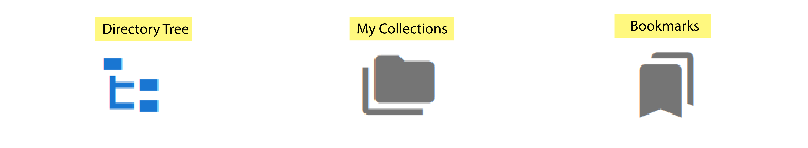

# User Guide

## Files Manager

Files Manager consists of 4 sub components:
<ul>
    <li><b>Current Path + Directory Tools</b> for navigating up and down in the directory tree and relevant associated tools</li>
    <li><b>Directories </b> for showing where you are in the directory tree, quick access to your data.QBI mounted RDM collections and your bookmarks</li>
    <li><b>Search bar</b> for filtering files/folders in the current path</li>
    <li><b>Current directory</b> for showing files/folders in the current path</li>
</ul>

### Current Path and Directory Tools

The path to the current working location is shown along the top of the Files Manager page. Clicking on individual directory names will cause the current working directory to change to the chosen directory. 

Recent paths used in the portal are displayed when clicking the down arrow in the left of the Current Path bar.
   

<b>Directory Tools available include </b> 
<ul>
    <li>  <em> Allows you to move up one directory level</em> </li>
    <li>  <em> Allows you to save the current directory to your bookmarks list       </em> </li>
    <li>  <em> Allows you to copy the current directory file path to the system      clipboard </em> </li>
    <li>  <em> Allows you to create a new directory at this location </em> </li>
<li>  <em> Allows you open the file within a Virtual Desktop (see below) </em> </li>
</ul>

 

### Search bar

IPP supports 4 types of filter
<ul>
    <li><b>Contains</b> Files Manager displays any folder/file that contains the given search text</li>
    <li><b>StartsWith</b> Files Manager displays any folder/file that starts with the given search text</li>
    <li><b>EndsWith</b> Files Manager displays any folder/file that ends with the given search text</li>
    <li><b>Custom</b> Files Manager displays any folder/file that matches the [glob filter](https://facelessuser.github.io/wcmatch/glob/) specified in the given search text</li>
</ul>

 

### Directory Groups
Navigating the file system under the IPP is managed by the Directories Groups on the left hand side of the Files Manager Page. 

 

There are 3 Directory Groups:
<ul>
    <li><b>Navigator</b> Displays the full directory tree structure for the complete filesystem</li>
    <li><b>Collections</b> Displays all RDM collections mounted at QBI that the current user has Read/Write permissions for</li>
    <li><b>Bookmarks</b> Displays any directory the current user has bookmarked</li>
 </ul>
 

### Visualising your image files on CVL
The Characterisation Virtual Laboratory (CVL) platform is an Linux based virtual dekstop that can be run within your browser, populated with open-source software tools such as Fiji and Napari. For more information on how to access CVL please see the following [Guide](https://characterisation-virtual-laboratory.github.io/CVL_Community/CVLWiener/)

Selecting the file from within the Files Manger page will allow you to then click the Launch Virtual Desktop button in the top right toolbar. Here you can spin up a CVL instance and launch the selected image file into either Napari or Fiji. Note you can edit the resources allocated to your CVL session upto a limit of (1xNode, 4xProcessors(cores), 32GB Memory (per processor)).

## Converter

The file converter currently only supports the conversion of .ims files into .tif files. With plans to increase this to other input file types in the future.

### .ims to .tif
The .ims to .tif file converter expects large multi-dimensional (3D time-series) .ims files (either from an Andor Dragonfly Spinning Disc Confocal or from the Imaris Visualisation program) and will output individual timepoints as a .tif file.

## Preprocessing

## Deconvolution

## Jobs Management
