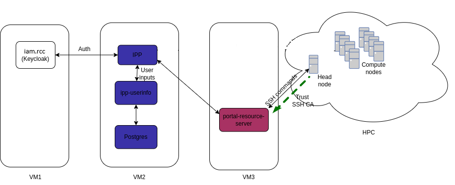

# Suggested Configuration

Note that this is a suggested configuration. VM2 and VM3 can be the same machine. But usually VN3 is a VM that is either within or close to the HPC. 

VM1 and VM2 can be anywhere in the Cloud. 

## Keycloak
* Keycloak should be hooked with Identity Providers such as AAF or UQSSO
* LDAP/AD can be used to limit users that can access to the service

 Once Keycloak is setup, 3 clients need to be created: one for javascript client (access type: public) and one for portal resource server (access type: confidential) and one for userinfo service (access type: confidential)

## ipp
This is supported by https://github.com/UQ-RCC/ipp-deployment

## portal-resource-server

### Creating a SSH CA

> ssh-keygen -b 4096 -f server_ca

This command generates server_ca (private key) and server_ca.pub (public key)

### Trust the SSH-CA
*server_ca.pub* needs to be distributed to the HPC headnode and trusted by the headnode. 
Assuming server_ca.pub is copied to /etc/ssh/server_ca.pub, the following should be added to the headnode sshd config file.

> 
    Match Group sysadmin
      TrustedUserCAKeys none
      AuthorizedKeysFile .ssh/authorized_keys

    Match Address __VM3_IPAdress__
      TrustedUserCAKeys /etc/ssh/server_ca.pub
      PasswordAuthentication no
      PermitRootLogin no
      PubkeyAuthentication yes
      AllowAgentForwarding no
      AllowTcpForwarding no
      X11Forwarding no
      AuthorizedKeysFile none 

Replacing sysadmin to any group for system admins. This basically only allows server_ca mechanism to work with non admin accounts.

### Deploy the portal-resource-server
* Follow the instructions given [here](https://github.com/UQ-RCC/rcc-portals/tree/main/charts/resourceserver) to deploy resource server using helm charts. 
