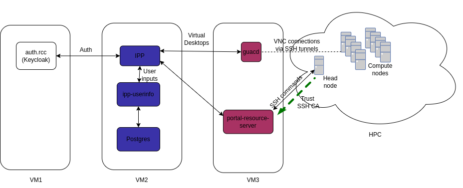

# Suggested Configuration

Note that this is a suggested configuration. VM2 and VM3 can be the same machine. But usually VN3 is a VM that is either within or close to the HPC. 

VM1 and VM2 can be anywhere in the Cloud. 

## Keycloak
* Keycloak should be hooked with Identity Providers such as AAF or UQSSO
* LDAP/AD can be used to limit users that can access to the service

 Once Keycloak is setup, 3 clients need to be created: one for javascript client (access type: public) and one for portal resource server (access type: confidential) and one for userinfo service (access type: confidential)

## ipp
This is supported by https://github.com/UQ-RCC/ipp-deployment

## portal-resource-server

### Creating a SSH CA

> ssh-keygen -b 4096 -f server_ca

This command generates server_ca (private key) and server_ca.pub (public key)

### Trust the SSH-CA
*server_ca.pub* needs to be distributed to the HPC headnode and trusted by the headnode. 
Assuming server_ca.pub is copied to /etc/ssh/server_ca.pub, the following should be added to the headnode sshd config file.

> 
    Match Group sysadmin
      TrustedUserCAKeys none
      AuthorizedKeysFile .ssh/authorized_keys

    Match Address __VM3_IPAdress__
      TrustedUserCAKeys /etc/ssh/server_ca.pub
      PasswordAuthentication no
      PermitRootLogin no
      PubkeyAuthentication yes
      AllowAgentForwarding no
      AllowTcpForwarding no
      X11Forwarding no
      AuthorizedKeysFile none 

Replacing sysadmin to any group for system admins. This basically only allows server_ca mechanism to work with non admin accounts.

### Config machine running portal-resource-server
* Download latest release of [portal-resource-server releases](https://github.com/UQ-RCC/portal-resource-server/releases), unzip it (assuming to /opt/portal-resource-server)
* Copy and modify [API definition json file](https://github.com/UQ-RCC/ipp-scripts/blob/main/wiener_prod.json) to /var/lib/portal-resource-server/api.json. Make sure the json file is modified to reflect correct paths and scheduler in HPC. 
* Edit config file in /opt/portal-resource-server/etc/portal-resource-server/application.yml

> 
    server:
        port: 9005
        use-forward-headers: true
        servlet:
            contextPath: /resourceserver

    resource-server:
        tmpdir: /tmp
        jsonfile: /var/lib/portal-resource-server/api.json
        remote-host: __HEADNODE__
        cert:
            key-algorithm: RSA
            key-bits: 4096
            rng-algorithm: NativePRNGNonBlocking
            validity: 300 # 5 minutes
            # Only the private key is needed
            ca_private: __server_ca_location__
            ca_passphrase: __passphrase__

    spring:
        security:
            oauth2:
            resourceserver:
                jwt:
                jwk-set-uri: https://__keycloak_url__/auth/realms/__realm__/protocol/openid-connect/certs
                issuer-uri: https://__keycloak_url__/auth/realms/__realm__
                client-id: __client_id__
                client-secret: __client_secret__
                audience-id: __js_client_name___

* Add systemd service config file
> 
    [Unit]
    Description=Portal Resource Server
    After=network.target

    [Service]
    Type=simple
    User=root
    Group=root
    RuntimeDirectory=portal-resource-server-dev
    RuntimeDirectoryMode=770
    PrivateTmp=true
    WorkingDirectory=/var/lib/portal-resource-server
    ExecStart=/opt/portal-resource-server/bin/portal-resource-server \
        --spring.config.location=/opt/portal-resource-server/etc/portal-resource-server/application.yml \
        --logging.config=/opt/portal-resource-server/etc/portal-resource-server/logback-spring.xml    
    SuccessExitStatus=143

    [Install]
    WantedBy=multi-user.target

* Config nginx
Make sure the portal-resource-server is added to nginx (inside nginx conf ssl definition for instance)

> 
    location /resourceserver {
                add_header                                              'Access-Control-Allow-Methods'          'POST, PUT, GET, OPTIONS, DELETE' always;
                add_header                                              'Access-Control-Allow-Headers'          'Authorization, Content-Type' always;
                add_header                                              'Access-Control-Allow-Credentials'      'true' always;
                if ($request_method = 'OPTIONS') {
                        add_header                                      'Access-Control-Allow-Origin'           '*';
                        add_header                                      'Access-Control-Allow-Methods'          'POST, PUT, GET, OPTIONS, DELETE';
                        add_header                                      'Access-Control-Allow-Headers'          'Authorization, Content-Type';
                        add_header                                      'Access-Control-Allow-Credentials'      'true';
                        add_header                                      'Access-Control-Max-Age'                '3600';
                        add_header                                      'Content-Type'                          'text/plain charset=UTF-8';
                        add_header                                      'Content-Length'                                        0;
                        return 204;
                }

                proxy_read_timeout  600s;
                proxy_pass                      http://localhost:9005/resourceserver;
                proxy_set_header                Host $host;
                proxy_set_header                X-Real-IP $remote_addr;
                proxy_set_header                X-Forwarded-Host $http_host;
                proxy_set_header                X-Forwarded-Server $http_host;
                proxy_set_header                X-Forwarded-For $proxy_add_x_forwarded_for;
        }
