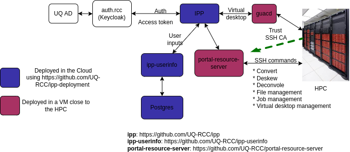

# Overall Architecture

The Image Processing Portal (IPP) consists of 4 components:
* auth server which is a Keycloak server. This Keycloak instance relies on UQSSO for authentication, and only lets a certain users from a branch in UQAD to login. The ipp uses keycloak-js for authentication, and to acquire an access token used to make request to ipp-userinfo and the portal-resource-server. 
* [ipp-userinfo](https://github.com/UQ-RCC/ipp-userinfo): this provides a REST API (written in Python [FastAPI](https://fastapi.tiangolo.com/)) for storing user inputs and user jobs. 
* [portal-resourcer-server](https://github.com/UQ-RCC/portal-resource-server): this Springboot application provides REST API to invoke commands specified in a [json file](https://github.com/UQ-RCC/ipp-scripts/blob/main/wiener_prod.json). Each command triggers a SSH command to be executed in the HPC. The result of the SSH command is returned and displayed to users in IPP. 
* [ipp](https://github.com/UQ-RCC/ipp): this vuejs SPA is the main interface for users. The features are already detailed in the user guide.
* [guacd](https://guacamole.apache.org): Guacamole daemon to serve virtual desktops running in the HPC.
